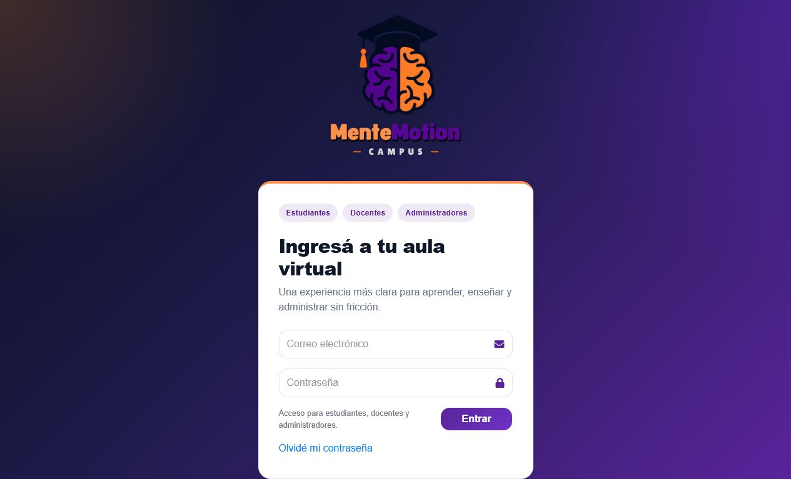
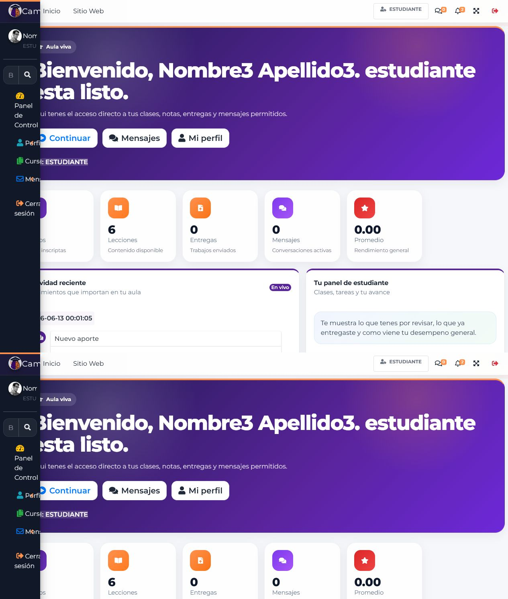
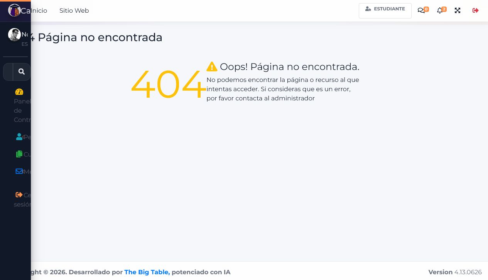
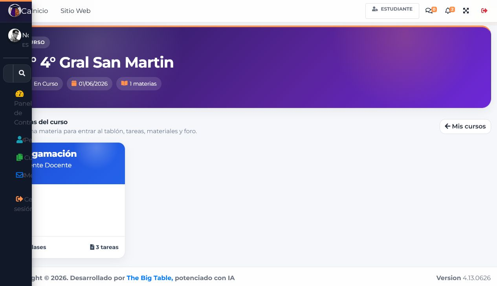
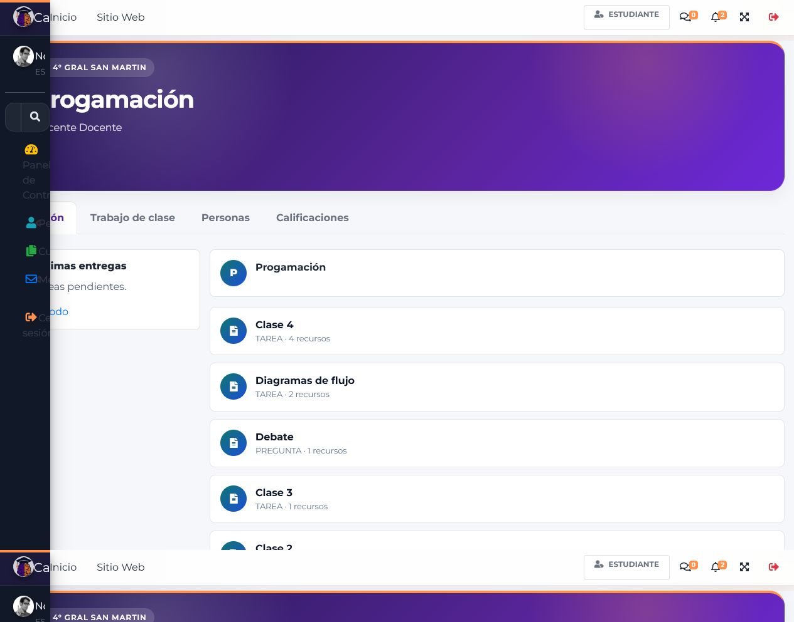
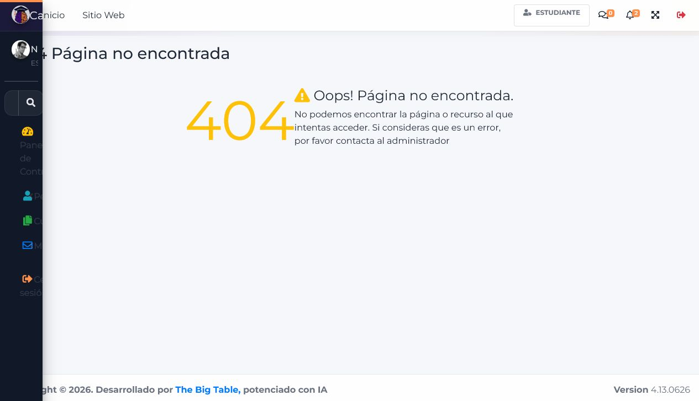
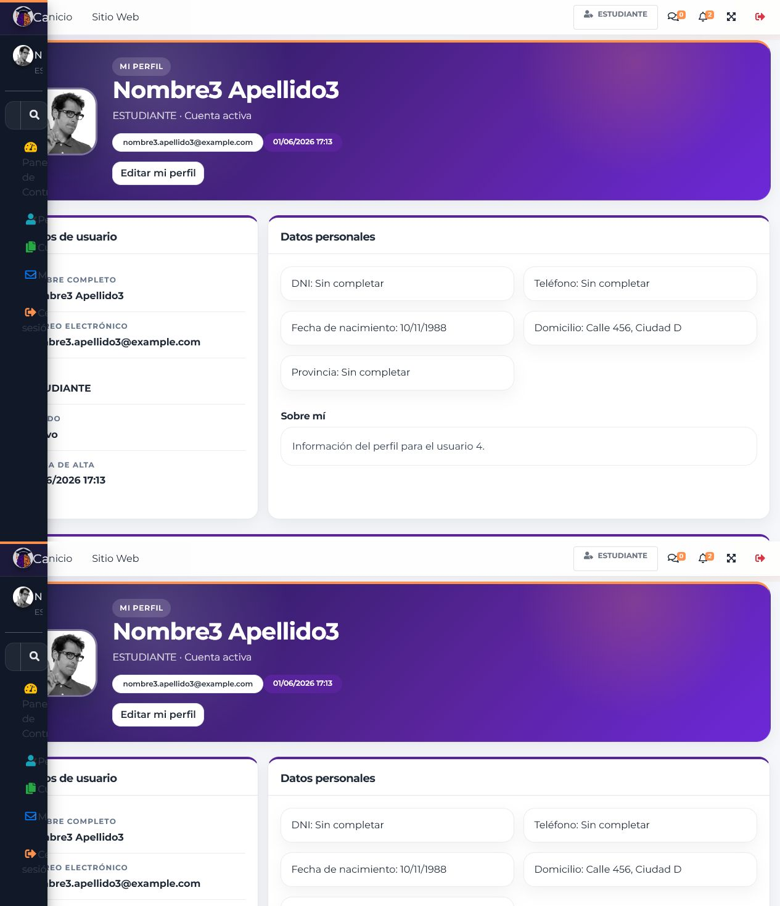
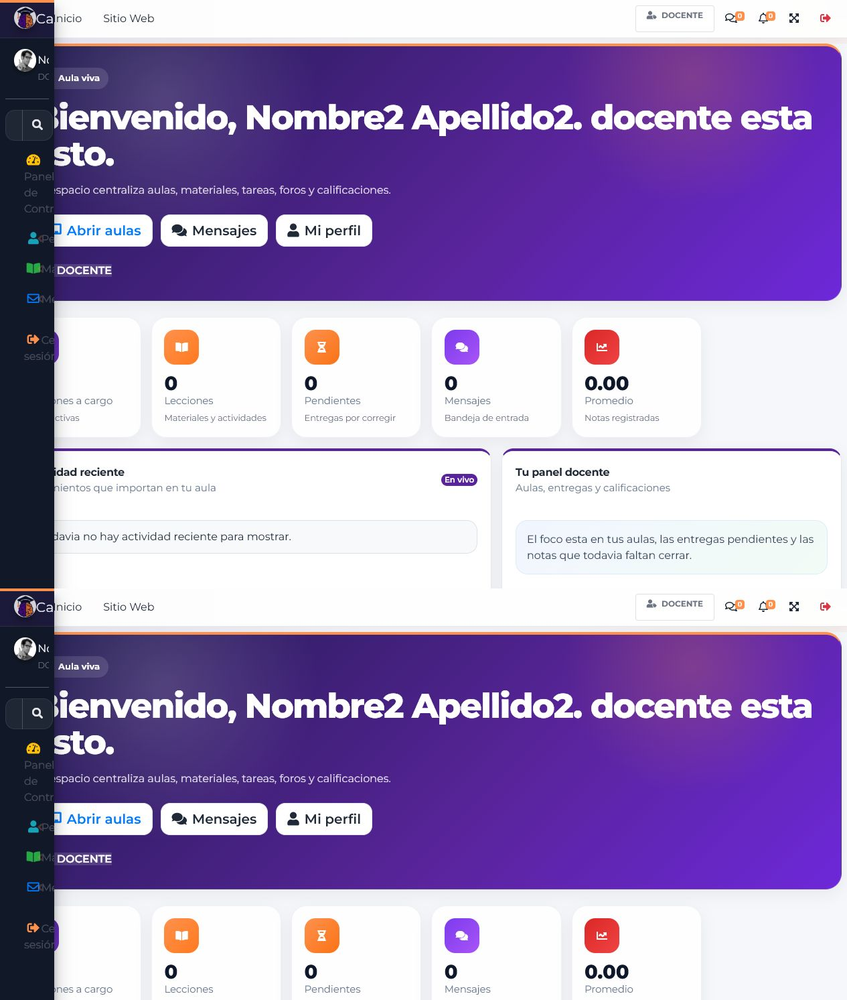
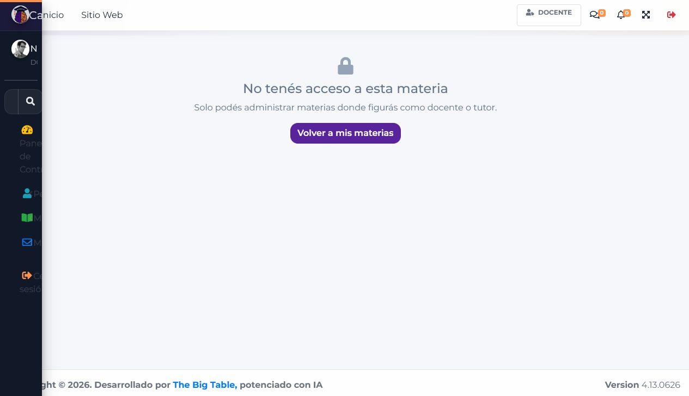

# Manual de usuario del Campus

Guia rapida para estudiantes y docentes.

## 1. Iniciar sesion

Entrar al Campus desde la URL indicada por la institucion. Escribir correo y contrasena, luego presionar `Entrar`.

Si el usuario fue creado desde WordPress, se usa el mismo correo y la misma contrasena de `mentemotion.com`.

## 2. Panel principal

Al ingresar se muestra el panel inicial. Desde ahi se accede a cursos, mensajes, perfil y notificaciones.

Los accesos disponibles pueden cambiar segun el rol del usuario.

## 3. Mis cursos

En `Cursos` se muestran las aulas donde el estudiante esta inscripto o donde el docente participa.

Para entrar, seleccionar el curso correspondiente.

## 4. Materias del curso

Dentro de un curso aparecen las materias o secciones disponibles. Cada materia tiene su propio tablon, trabajos, personas y calificaciones.

Seleccionar la materia para ver el contenido.

## 5. Vista de materia

La materia organiza el contenido en pestanas:

- `Tablon`: novedades y actividad reciente.
- `Trabajo de clase`: materiales, tareas y preguntas.
- `Personas`: docentes, tutores y companeros.
- `Calificaciones`: notas y devoluciones.

## 6. Tareas y materiales

En `Trabajo de clase` se ven las lecciones publicadas por el docente.

Una leccion puede ser:

- `Material`: contenido de lectura o recursos.
- `Tarea`: actividad que puede requerir entrega.
- `Pregunta`: espacio de participacion o debate.

Si una tarea permite entrega, el estudiante puede subir archivos o completar el texto solicitado. Si todavia no fue calificada, puede corregir o cancelar la entrega.

## 7. Mensajes

Desde `Mensajes` se puede acceder a la bandeja de entrada, enviados y papelera.

Los estudiantes pueden escribir a:

- companeros de su mismo curso o materia.
- docentes o tutores de sus materias.

Los docentes y administradores pueden escribir a estudiantes, docentes, administradores o secciones completas.

## 8. Perfil

En `Perfil` se muestran los datos personales, foto, cursos y materias relacionadas.

Desde `Editar mi perfil` se pueden actualizar:

- foto de perfil.
- DNI.
- telefono.
- fecha de nacimiento.
- domicilio.
- provincia.
- informacion de `Sobre mi`.
- contrasena, solo cuando se edita el perfil propio.

## 9. Panel docente

El docente tiene acceso a sus cursos y materias asignadas. Desde el panel puede revisar actividad, entregas pendientes, mensajes y seguimiento academico.

## 10. Gestion de materia para docentes

Dentro de una materia, el docente puede:

- crear lecciones.
- guardar borradores.
- publicar materiales, tareas o preguntas.
- agregar archivos adjuntos y enlaces.
- revisar estudiantes inscriptos.
- corregir tareas.
- cargar notas y devoluciones.

## 11. Recomendaciones de uso

- Revisar el tablon y trabajo de clase con frecuencia.
- Mantener actualizado el perfil.
- Usar mensajes para consultas puntuales.
- En tareas, leer la consigna completa antes de entregar.
- En docentes, usar borradores para preparar clases antes de publicarlas.

## 12. Problemas frecuentes

Si no se puede ingresar:

- comprobar correo y contrasena.
- si el usuario viene de WordPress, probar primero iniciar sesion en `mentemotion.com`.
- solicitar al administrador que revise si el usuario esta activo.

Si no aparece un curso o materia:

- revisar si el estudiante fue inscripto.
- revisar si el docente fue asignado como docente o tutor de la materia.

Si una entrega no se puede editar:

- puede estar ya calificada.
- consultar al docente o administrador.
